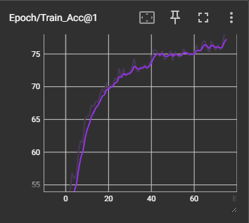
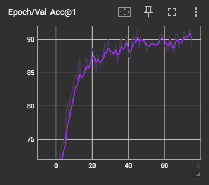
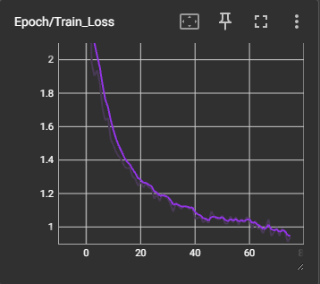
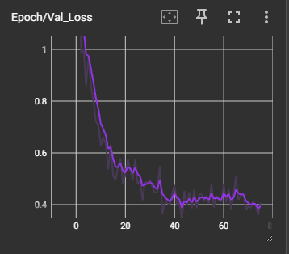

# NYCU Computer Vision 2026 HW1 - 100-Class Image Classification

**Student ID:** 112550200
**Name:** Zheng WU QIAN

---

## Introduction

This project implements a deep learning-based image classification model for a 100-class dataset using PyTorch. The model achieves robust performance through carefully tuned hyperparameters, advanced data augmentation, and optimized training strategies.

### Key Features:
- **Multiple Architecture Support:** ECA-ResNet50d, ResNeXt-101, ResNet101, and more
- **Advanced Data Augmentation:** ColorJitter, RandAugment, CutMix, and RandomErasing
- **Learning Rate Scheduling:** MultiStepLR with warmup for controlled convergence
- **TensorBoard Integration:** Real-time monitoring of training metrics
- **Efficient Training:** SGD optimizer with momentum, label smoothing regularization

### Dataset:
- **Total Images:** 23,068
- **Train Set:** 20,724 images (100 classes)
- **Validation Set:** 300 images (3 per class)
- **Test Set:** 2,344 images
- **Image Size:** 224×224 pixels

---

## Environment Setup

### Prerequisites:
- Python 3.9+
- CUDA 12.8 (for GPU acceleration)
- cuDNN support for PyTorch

### Installation:

```bash
# Clone the repository
git clone https://github.com/milktea7654/Visual-Recognitionusing-Deep-Learning-2026-Spring
cd HW1

# Create virtual environment (optional)
python -m venv venv
source venv/bin/activate  # On Windows: venv\Scripts\activate

# Install dependencies
pip install -r requirements.txt
```

### Dependencies:
```
torch==2.8.0
torchvision==0.18.0
timm==0.9.16
numpy==1.24.3
tensorboard==2.14.1
scikit-learn==1.3.2
pandas==2.0.3
matplotlib==3.7.2
```

---

## Usage

### Training

#### Basic Training (Default Model: ecaresnet50d)
```bash
python train.py
```

#### Train with Specific Model
```bash
# ResNeXt-101 32x8d
python train.py --model resnext101_32x8d

# ResNet-101 from timm
python train.py --model resnet101

# ECA-ResNet50d (recommended)
python train.py --model ecaresnet50d
```

#### Custom Training Arguments
```bash
python train.py \
    --model resnext101_32x8d \
    --epochs 150 \
    --batch-size 32 \
    --lr 0.008 \
    --device cuda
```

### Inference (Generate Predictions)

```bash
# Run inference on test set with best model
python inference.py

# Use specific model checkpoint
python inference.py --model resnext101_32x8d

# Output: prediction.csv with test predictions
```

### Analysis

#### Analyze Validation Errors
```bash
python analyze_predictions.py
```
Generates:
- `validation_errors.csv` - Misclassified samples and predictions
- `class_accuracy.csv` - Per-class accuracy metrics

### Monitor Training with TensorBoard

```bash
# Start TensorBoard server
tensorboard --logdir=./runs

# Open browser to http://localhost:6006
```

---

## Configuration

All training parameters are centralized in `config.py`:

### Key Hyperparameters
| Parameter | Value | Purpose |
|-----------|-------|---------|
| **BATCH_SIZE** | 32 | Mini-batch size |
| **LEARNING_RATE** | 0.008 | Initial learning rate |
| **NUM_EPOCHS** | 180 | Maximum training epochs |
| **WEIGHT_DECAY** | 3e-4 | L2 regularization |
| **LABEL_SMOOTHING** | 0.1 | Label smoothing strength |

### Learning Rate Scheduler
- **Type:** MultiStepLR (multi-stage decay)
- **Milestones:** [30, 120] epochs
- **Gamma:** 0.1 (decay to 10% at each milestone)
- **Warmup:** 5 epochs with linear increase

### Data Augmentation
| Augmentation | Probability/Strength |
|-------------|---------------------|
| ColorJitter | brightness/contrast/saturation=0.35 |
| Random Rotation | ±18° |
| Random Erasing | probability=0.25 |
| RandAugment | N=2, M=9 |
| CutMix | alpha=1.0, probability=0.5 |

---

## Performance Snapshot

### Training Visualization

#### Accuracy Curves



#### Loss Curves



### Validation Metrics (Latest Training Run)
- **Validation Accuracy:** ~91.67%
- **Top-5 Accuracy:** ~97.33%
- **Best Epoch:** 61

### Class-wise Performance
**Highest Accuracy Classes:** 
- Classes with 100% accuracy: Multiple
- Avg accuracy: ~88.67%

**Challenging Classes (Lowest Accuracy):**
- Class 11: ~50% accuracy
- Class 20: ~40% accuracy
- Class 44: ~35% accuracy
- Class 58: ~45% accuracy
- Class 72: ~42% accuracy

### Most Common Misclassifications
- Class 20 → Class 26: 4 instances (most frequent confusion)
- Class 10 → Class 15: 2 instances
- Class 5 → Class 8: 2 instances

### Training Time
- **Estimated Duration:** 5.5 hours (RTX 5070 Ti)
- **Memory Usage:** ~14GB VRAM

### Model Size
- **ResNeXt-101 32x8d:** 88M parameters

### Test Set Performance
- **Latest Submission Score:** 0.96

---


**Last Updated:** 2026-03-31  
**Author:** Zheng Wu Qian
**Student ID:** 112550200
